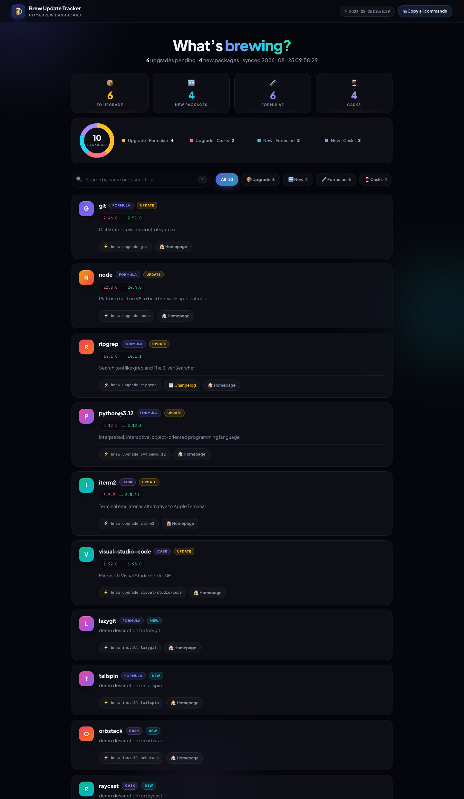

# 🍺 Brew Upgrade Tracker

[](https://github.com/cicciocanestro/brew-update-tracker/actions/workflows/ci.yml)

A smart Homebrew helper script that enhances the update and upgrade process by providing detailed information about available package updates.

## 📸 Screenshots

**Interactive dashboard** (default mode — automatically opened in your browser):



**Terminal report** (`--no-dashboard`):

```console
$ ./brew_upgrade_tracker.sh --no-dashboard
🍺 Brew Update Tracker
=======================

🔄 Updating Homebrew...
.
Updated 4 taps (2026-08-25).
==> New Formulae
lazygit: simple terminal UI for git commands
tailspin: log file highlighter
==> New Casks
orbstack (1.7.4)
raycast (1.80.0)

🔍 Finding outdated packages...

📊 📦 Updated Formulae:
  - git:
      Homepage: https://git-scm.com
      Description: Distributed revision control system
  - node:
      Homepage: https://nodejs.org/
      Description: Platform built on V8 to build network applications
  …

📊 📦 Updated Casks:
  - iterm2:
      Homepage: https://iterm2.com
      Description: Terminal emulator as alternative to Apple Terminal
  - visual-studio-code:
      Homepage: https://code.visualstudio.com/
      Description: Microsoft Visual Studio Code IDE

🆕 New Formulae / New Casks:
  - lazygit, tailspin, orbstack, raycast
      (homepage & description shown for each)

🚀 Found 6 package(s) that can be upgraded.
Do you want to perform 'brew upgrade' now? (y/n): n
✋ Upgrade skipped.

📝 Dashboard skipped (--no-dashboard).

🍺 Brew Update Tracker completed!
```

## 📋 Description

This repository contains a ZSH script that wraps around Homebrew's update and upgrade functionality, providing additional insights and control. It tracks installed packages before and after running `brew update`, shows detailed information about available updates (including package homepages and descriptions), and lets you decide whether to proceed with the upgrade process.

Since v3.0.0 the two former scripts (the CLI-only `brew_upgrade_tracker.sh` and `brew_upgrade_tracker_v2.sh`) are merged into a **single script**:

- **Default mode**: terminal report + interactive HTML dashboard opened in your browser.
- **`--no-dashboard`** (`-n`): terminal-only mode — the behavior of the old CLI-only script; never generates HTML and never opens a browser.

## 🔧 Prerequisites

- macOS with [Homebrew](https://brew.sh/) installed
- [jq](https://stedolan.github.io/jq/) (JSON processor) - strictly required for fast JSON bulk processing. The script will check for this dependency.
- ZSH shell (default on modern macOS installations)

## 📥 Installation

1. Clone or download this repository:
   ```bash
   git clone [https://github.com/cicciocanestro/brew-update-tracker.git](https://github.com/cicciocanestro/brew-update-tracker.git)
   ```
   or download the script directly.

2. Make the script executable:
   ```bash
   chmod +x brew_upgrade_tracker.sh
   ```

3. Optionally, move the script to a directory in your PATH for easier access:
   ```bash
   mv brew_upgrade_tracker.sh /usr/local/bin/brew_upgrade_tracker
   ```

## 🚀 Usage

Simply run the script from your terminal:

```bash
./brew_upgrade_tracker.sh
```

### Options & Flags

- `-y`, `--yes`: Automatically perform `brew upgrade` without prompting for confirmation.
- `-n`, `--no-dashboard`: Terminal-only mode — skip HTML dashboard generation (never opens a browser).
- `-h`, `--help`: Display usage instructions and exit.

Unknown flags abort with an error and the usage help instead of being silently ignored.

Examples:

```bash
# Run interactively (prints report, opens HTML dashboard & prompts before upgrading)
./brew_upgrade_tracker.sh

# Run non-interactively with auto-upgrade
./brew_upgrade_tracker.sh -y

# Terminal-only mode: same report, no dashboard, no browser
./brew_upgrade_tracker.sh --no-dashboard

# Auto-upgrade without dashboard (e.g. for cron jobs / automation)
./brew_upgrade_tracker.sh -y -n
```

## ✨ Features

- 🌐 **Interactive HTML Dashboard**: Automatically generates and opens a state-of-the-art web dashboard in your default browser:
  - **Dark Mode UI**: Sleek, modern design with responsive layout.
  - **Real-Time Search & Filtering**: Instantly search packages by name or description.
  - **Category Tabs**: Easily switch between All, Outdated Formulae/Casks, and New Formulae/Casks.
  - **Version Transition Badges**: Visual indicator for version updates (`installed → latest`).
  - **Changelog & Homepage Direct Links**: Automatically parses and extracts direct GitHub Release / Changelog links (`📋 Changelog`) and official Homepages (`🏠 Homepage`).
  - **One-Click Command Copy**: Quick buttons to copy `brew upgrade <pkg>` or `brew install <pkg>` directly to your clipboard.
- ⚡ **Blazing Fast Performance**: Utilizes Homebrew's native JSON output (`--json=v2`) and bulk processing via `xargs` and `jq` to fetch package information instantly, eliminating long wait times.
- 📊 **Comprehensive Package Tracking**: Records and compares installed Homebrew formulae and casks before and after updates.
- 🔍 **Detailed Package Metadata**: Displays homepage links and descriptions for all updated and new packages in both CLI and Dashboard.
- 🆕 **New Package Detection**: Identifies newly available formulae and casks in Homebrew repositories.
- ⚙️ **Interactive or Automated Upgrade Process**: Prompts for confirmation before running `brew upgrade`, or runs automatically with `-y`/`--yes`.
- 🎨 **Colorful Terminal Output & Progress Spinner**: Clean terminal feedback with visual spinner during `brew update`.
- 🧹 **Clean Operation**: Creates temporary files and log files that are automatically cleaned up upon successful completion.
- 📝 **Enhanced Error Handling**: 
  - Gracefully handles package lookup failures.
  - Continues operation even when encountering non-critical errors.
  - Logs errors to a dedicated log file when issues occur.

## 🖥️ Output Notes

- The script uses colored output to distinguish between different types of information:
  - 🟢 Green: Success messages and status information
  - 🔵 Cyan: Process steps and status updates
  - 🟡 Yellow: Prompts and warnings
  - 🔴 Red: Error messages

- The script generates a modern HTML dashboard at `/tmp/brew-update-landing.html` and opens it in your default browser.
- When non-critical errors occur, the script will:
  - Continue execution rather than failing completely
  - Log detailed error information to a temporary log file
  - Display a warning message with the log file location
  - Clean up the log file if no errors occurred

## 🚫 Troubleshooting

If you encounter any issues:

1. Ensure Homebrew is correctly installed and functioning.
2. Verify that jq is installed (`brew install jq`).
3. Check that the script has execute permissions (`chmod +x brew_upgrade_tracker.sh`).
4. Review the log file if any warnings appear during execution.
5. For package-specific issues, try running `brew doctor`.

## 📄 License

This project is licensed under the MIT License - see the [LICENSE](LICENSE) file for details.

## 📝 Changelog

See [CHANGELOG.md](CHANGELOG.md) for a summary of recent fixes and improvements. The latest v2.0.0 release introduces the interactive HTML Dashboard, CLI flags (`-y`/`-h`), visual progress spinners, and performance optimizations.